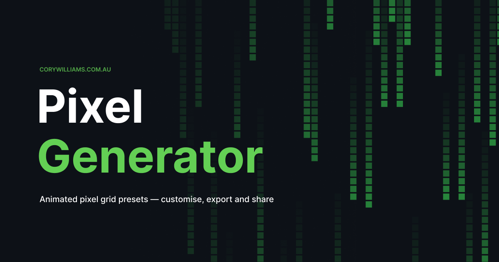

# Pixel Generator

A browser-based tool for creating and exporting animated pixel animations. Pick from 50+ presets, customise colours and grid settings, then export clean vanilla HTML + JS with one click.

**[pixel-generator.corywilliams.com.au](https://pixel-generator.corywilliams.com.au)**



## Features

- 50+ animation presets — waves, cellular automata, pixel art, loaders, and more
- 9 colour palettes
- Adjustable grid size, pixel size, gap, and FPS
- Export as self-contained vanilla HTML + JS (no dependencies)
- Shareable URLs — settings are encoded in the URL
- Mobile-friendly with a spring-animated bottom sheet

## Running locally

```bash
npm install
npm run dev
```

## Built with

- [React 18](https://react.dev) + [Vite](https://vitejs.dev)
- [@use-gesture/react](https://use-gesture.netlify.app) for mobile drag gestures
- Hosted on [Netlify](https://netlify.com)

## License

MIT — free to use and modify. See [LICENSE](LICENSE).
